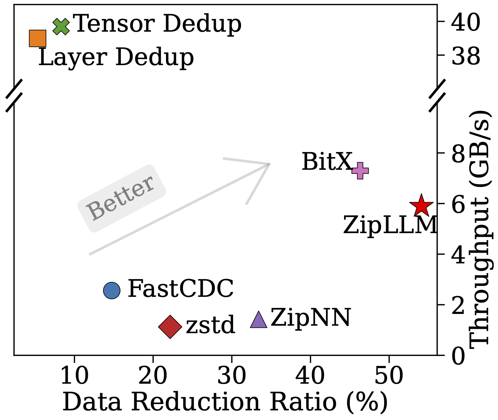
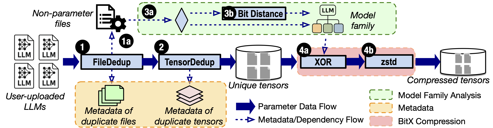

# ZipLLM - Efficient LLM Storage via Model-Aware Synergistic Data Deduplication and Compression

ZipLLM is an efficient LLM storage system that significantly reduces storage cost through tensor-level deduplication and BitX compression.

## Overview

ZipLLM is designed for storing many related LLM checkpoints (base models + fine-tuned variants) without paying full storage cost for every copy. Instead of compressing each checkpoint independently, ZipLLM performs model-aware deduplication at the tensor level and then applies BitX lossless compression to the remaining deltas computed by XORing a fine-tuned model against its base model. 

## Key Results

ZipLLM targets three practical outcomes for large-scale model storage systems:
- **Lower storage footprint** across families of related checkpoints
- **Fast restoration** for reconstructed models from compressed storage
- **Scalable processing** with multi-threaded compression/decompression paths

On a 3,000+ LLM storage dataset, ZipLLM significantly outperforms all baselines:

<p align="center">
  
</p>

For end-to-end quantitative results, see our [our NSDI'26 paper](https://arxiv.org/abs/2505.06252) and the benchmarking scripts in `analysis/`.

## Design Charts

### ZipLLM pipeline at a glance




## Prerequisites

### Device Requirements

⚠️ **Important**: ZipLLM requires substantial memory resources for processing large language models.

**Tested Environment:**
- **Platform**: AWS EC2 c5.12xlarge instance
- **Memory**: 96GB RAM
- **vCPUs**: 48 cores
- **Storage**: High-performance SSD storage

**⚠️ Memory Warning**: 
- Models with insufficient memory may cause the program to crash during processing
- Large language models (7B+ parameters) require significant RAM for tensor operations
- Consider using smaller models or adding swap space if you have limited memory

### Install Rust
```bash
# Install Rust (if not already installed)
curl --proto '=https' --tlsv1.2 -sSf https://sh.rustup.rs | sh
source ~/.cargo/env

# Verify installation
rustc --version
cargo --version
```

### Python Dependencies
```bash
# Install required Python packages
pip3 install -r requirements.txt
```

### Hugging Face Token
```bash
# Set your HF token for model downloads
export HF_TOKEN=your_token_here
```

## Quick Start

### 1. Setup Test Environment
```bash
# Configure paths (edit if needed)
vim config.json

# Download test models and generate base-finetune mapping
./setup_test_models.sh
```
### 2. Build Project
```bash
cargo build --release
```

### 3. Run Model Compression
```bash
# Run with config path (required)
RUST_LOG=info ./target/release/zipllm ./config.json
```

### 4. Restore Models
```bash
# Restore using real model ID format (config path is required)
RUST_LOG=info ./target/release/restore ./config.json meta-llama/Llama-3.1-8B-Instruct /tmp/output

# Verify restoration
ls -la /tmp/output/
```

## Performance Testing

### Restore Performance Testing

Test restore performance across different thread counts:

```bash
cd analysis
# Run experiments with different thread counts (config path is required)
python3 restore_throughput_analysis.py --threads 1 2 4 8 16 32 48 --config "../config.json"

# Only analyze existing results
python3 restore_throughput_analysis.py --analyze-only --config "../config.json"

# Run experiments and analyze results automatically
python3 restore_throughput_analysis.py --threads 1 4 8 16 --analyze --config "../config.json"

# Optionally drop system caches before each run (requires sudo)
python3 restore_throughput_analysis.py --threads 1 2 4 --drop-cache --config "../config.json"
```

Features:
- Tests restore performance with different thread configurations  
- Generates CSV reports and visualization plots
- Shows throughput vs thread count relationships
- Analyzes threading efficiency compared to single-thread baseline
- Optionally clears system cache before each experiment when using `--drop-cache`

### Compression Throughput Analysis

Benchmark BitX compression performance with different thread counts:

```bash
cd analysis
# Run compression benchmark with thread count variations
python3 compression_throughput_analysis.py /path/to/base/model /path/to/finetune/model

# Specify thread counts to test
python3 compression_throughput_analysis.py /path/to/base/model /path/to/finetune/model --threads 1,4,8,16,32

# Skip decompression test
python3 compression_throughput_analysis.py /path/to/base/model /path/to/finetune/model --no-decompress

# Custom output prefix for result files
python3 compression_throughput_analysis.py /path/to/base/model /path/to/finetune/model --output custom_prefix

# Run each test multiple times
python3 compression_throughput_analysis.py /path/to/base/model /path/to/finetune/model --repeat 3
```

Features:
- Measures BitX compression and decompression throughput
- Tests multiple thread configurations
- Generates CSV reports with detailed metrics
- Creates throughput vs thread count plots
- Validates bit-exact decompression

## Experiments

### FastCDC and ZipNN Experiments

Run content-defined chunking and neural network compression experiments:

```bash
cd experiment
# Configure paths in config.json
vim config.json

# Run both FastCDC chunking and ZipNN compression
python3 run_exp.py

# View results and get figures 
jupyter notebook plots.ipynb
```

Features:
- Processes safetensors files with FastCDC content-defined chunking
- Compresses models with ZipNN compression
- Saves results for later analysis
- Visualizes data reduction ratios with plots.ipynb

## Project Structure

```
zipllm_rust/
├── src/
│   ├── main.rs                # Main compression pipeline
│   ├── restore.rs             # Model restoration binary
│   ├── config.rs              # Configuration loader
│   ├── storage.rs             # Storage backend
│   ├── pipeline.rs            # Processing pipeline
│   ├── deduplication.rs       # Tensor deduplication
│   ├── compression.rs         # Compression strategies
│   └── bitx/bitx_bytes.rs     # BitX differential compression
├── examples/
│   ├── bitx.rs                # Standalone BitX tool
│   └── restore_example.rs     # API usage example
├── experiment/
│   ├── run_exp.py             # Run FastCDC and ZipNN experiments
│   ├── zipnn_exp.py           # ZipNN compression tool
│   ├── fastcdc_exp/           # FastCDC chunking implementation
│   └── plots.ipynb            # Visualization notebook for results
├── analysis/
│   ├── restore_throughput_analysis.py # Restore performance testing
│   └── compression_throughput_analysis.py # Compression benchmarking
├── py_lib/
│   ├── download.py            # Model downloader
│   └── generate_base_ft.py    # Base-finetune mapper
├── config.json                # Configuration file
├── test_models.txt            # Test model list
├── setup_test_models.sh       # Automated setup
├── models/                    # Downloaded models
└── storage/                   # Compressed data
```

## Configuration

### Main Configuration

Edit `config.json` to customize paths and performance settings:

```json
{
  "model_dir": "./models",
  "storage_dir": "./HF_storage",
  "models_to_process": "./test_models.txt",
  "base_ft_path": "./base_ft.json",
  "threads": 48
} 
```

**Configuration Options:**
- `model_dir`: Directory containing downloaded models
- `storage_dir`: Directory for compressed tensor storage  
- `models_to_process`: Text file listing models to process
- `base_ft_path`: JSON file mapping base models to finetunes
- `threads`: Number of parallel threads (auto-detects system max if not specified)

**Important Path Resolution:**
- All paths in the config file are resolved relative to the config file's location, not the current working directory
- This means you can run commands from any directory and the paths will still work correctly
- For example, when running from the `analysis` directory with `--config "../config.json"`, paths like `./models` will be resolved relative to the parent directory

### Experiment Configuration

Edit `experiment/config.json` for FastCDC and ZipNN experiments:

```json
{
  "output_root": "./results",
  "model_root": "../models",
  "fastcdc_avg_size": 65536
}
```

**Experiment Configuration Options:**
- `output_root`: Directory for experiment output files
- `model_root`: Directory containing safetensors files to process
- `fastcdc_avg_size`: Average chunk size for FastCDC (in bytes)

## Examples and Tools

### BitX Standalone Tool

```bash
# Build and use BitX for file compression
cargo build --release --example bitx
./target/release/examples/bitx file1.bin file2.bin --compress \
  --compressed-exp exp.zst --compressed-sm mantissa.zst
```

## Important Notes
- **Config Path Required**: All commands now require specifying a config path as the first argument
- **Support Dtype**:⚠️ Current version only supports BF16
- **Logging**: Use `RUST_LOG=info` to see runtime progress and performance metrics
- **Test Models**: First line in `test_models.txt` must be the base model
- **Model IDs**: Use real Hugging Face format (`org/model-name`) - automatic conversion to storage format
- **HF_token**: To download models, don't forget to set your HF_token in the environments
- **Path Resolution**: All paths in config.json are resolved relative to the config file's location

## To Cite ZipLLM

If you use ZipLLM in your research, please cite:

```bibtex
@misc{zipllm,
  title        = {ZipLLM: Efficient LLM Storage via Model-Aware Synergistic Data Deduplication and Compression},
  author={Zirui Wang and Tingfeng Lan and Zhaoyuan Su and Juncheng Yang and Yue Cheng},
  booktitle = {23rd USENIX Symposium on Networked Systems Design and Implementation (NSDI 26)},
  year={2026},
  url = {https://www.usenix.org/conference/nsdi26/presentation/wang-zirui},
  publisher = {USENIX Association}
}
```

## Contributing

We welcome contributions to **ZipLLM**!  
If you have ideas, improvements, bug fixes, or new features, feel free to open an issue or submit a pull request.
